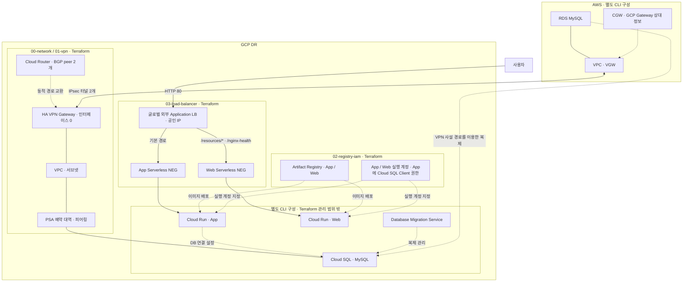

# GCP DR 인프라 배포

AWS RDS → GCP Cloud SQL 복제를 위한 사설 네트워크 기반을 구축합니다.

## DR 인프라 구성도

실선은 네트워크·요청 경로, 점선은 복제·배포·권한의 논리 관계입니다. Terraform 코드의 구성과 별도 CLI 구성 요소를 함께 표시한 것으로, 실제 배포·복제·장애 전환 완료를 뜻하지 않습니다.



두 VPN 터널은 GCP Gateway의 인터페이스 `0`을 공유합니다. GCP 양쪽 인터페이스를 사용하는 이중화 구성은 아닙니다. DB 복제와 Cloud Run 배포에는 별도 CLI 설정이 필요하며, DNS 전환·DB 승격을 포함한 자동 장애 전환은 이 저장소의 Terraform에 포함되지 않습니다.

| Terraform 실행 단위 | 생성하는 구성 |
| --- | --- |
| `00-network` | API 활성화, VPC·서브넷, PSA 예약 대역·연결·경로 설정, HA VPN Gateway, Cloud Router |
| `01-vpn` | AWS 상대 Gateway 등록, VPN 터널 2개, Router interface·BGP peer 각 2개 |
| `02-registry-iam` | Cloud Run 실행 계정, Cloud SQL 연결 권한, Artifact Registry. `dev/service-foundation` State 사용 |
| `03-load-balancer` | HTTP 80 글로벌 외부 Application LB, 공인 IP, App/Web Serverless NEG. `dev/edge` State 사용 |

폴더 이름과 State 식별자는 별개입니다. 네 레이어의 기존 State prefix는 순서대로 `dev/backbone`, `dev/vpn`, `dev/service-foundation`, `dev/edge`를 유지합니다. `00-network`는 `modules/network`를 호출하며, Terraform 호출 이름 `module "backbone"`과 기존 리소스 주소는 유지합니다. 기존 로컬 작업 폴더에서 모듈 경로를 갱신하려면 저장소 루트에서 `terraform -chdir=00-network get`을 실행합니다. 신규 초기화는 아래 `init` 절차를 따릅니다.

신규 환경은 부트스트랩 후 각 레이어의 빈 State에서 시작합니다. `02-registry-iam`이 App/Web 실행 계정, App의 Cloud SQL 연결 권한, 이미지 저장소 두 개를 생성합니다. 기존 자원의 import는 신규 생성 절차에 필요하지 않습니다.

계정 입력값과 `cloud_run_service_account` output은 `02-registry-iam`에서 관리합니다. 이미지 저장소는 App과 Web 두 개로 분리하며 `artifact_registry_url`, `artifact_registry_web_url` output을 각 이미지 업로드에 사용합니다. Artifact Registry API는 `00-network`에서 활성화하므로 해당 레이어를 먼저 적용합니다.

현재 PoC는 기존 Cloud SQL 마스터 계정으로 연결하며 IAM DB 인증은 후속 적용합니다. DB 비밀번호는 Cloud Run의 일반 환경변수에 직접 설정하며, Terraform과 Git에는 넣지 않습니다. Secret Manager 저장 공간·접근 권한·API 관리 항목은 사용자 적용으로 제거됐습니다. 기존 API 관리 항목의 `disable_on_destroy=false` 설정에 따라 API 활성화 자체는 남습니다.

배포 순서: **부트스트랩 → GCP 백본 → AWS VPN → GCP VPN → 연결 확인 → 서비스 기반 → 이미지 업로드 → Cloud Run CLI 배포 → HTTP LB**. 현재는 두 터널이 GCP 인터페이스 0을 공유하는 검증용 구성입니다.

재현 범위는 위 표의 Terraform 관리 자원입니다. 새 환경에서 필요한 CLI 선행 조건은 다음과 같습니다. Cloud SQL·DMS·Cloud Run과 이미지·DB 데이터는 Terraform apply만으로 복원되지 않습니다.

| 준비 시점 | CLI로 준비할 항목 | 완료 조건 |
| --- | --- | --- |
| 첫 `init` 전 | 결제 연결된 GCP 프로젝트, 실행 계정 권한·ADC, Service Usage·Cloud Resource Manager API, GCS State 버킷 | 대상 프로젝트 인증과 State 버킷 읽기/쓰기 가능 |
| `01-vpn` 전 | AWS VPC·VGW·CGW·VPN 연결 | 새 GCP Gateway IP로 연결하고 터널 IP·BGP·PSK를 입력 |
| Cloud Run 배포 전 | Cloud SQL, 필요한 DB 사용자·스키마·데이터, 복제가 필요한 경우 DMS | 새 VPC의 PSA 연결과 DB 접속 정보 준비 |
| `03-load-balancer` 전 | App/Web 이미지 업로드와 Cloud Run 서비스 배포 | `02-registry-iam`의 계정·저장소 사용, LB 입력과 같은 서비스 이름·리전, 요청을 받을 ingress·호출 권한 설정 |

새 프로젝트의 ID와 새 Gateway/IP 등 할당값은 환경 입력과 CLI 배포 설정에 반영합니다. 기존 dev 환경을 계속 관리할 때는 해당 환경의 원격 State를 사용합니다.

## 저장소 작성 규칙

[AGENTS.md](AGENTS.md)의 규칙을 따릅니다. `platform-infra`와 같이 레이어 루트에서 이름을 조립하고 모듈에는 `name`으로 전달합니다. `project`는 이름·라벨용 식별자이며 GCP의 실제 프로젝트 ID인 `project_id`와 구분합니다. `project = "last-lab"`, `env = "dev"`이면 기존 접두사 `last-lab-dev-dr`을 유지합니다.

각 레이어의 `backend.tf`는 GCS State 설정, `providers.tf`는 GCP 프로젝트·리전·공통 라벨, `versions.tf`는 버전을 관리합니다. 환경값은 `envs/<env>/`에 두며 변경 성격에 따른 기존 `immutable`·`mutable`·`secrets` 변수 구분을 유지합니다. 공통 라벨 `environment`, `project`, `managed_by`는 라벨 지원 리소스에 적용됩니다.

클론 후 env 파일의 커밋 차단 훅을 활성화합니다. `.env.example`에는 실제 비밀값을 넣지 않습니다. 훅은 파일 이름을 검사하며 모든 자격증명을 탐지하지는 않습니다.

```bash
git config core.hooksPath .githooks
```

로컬 검사:

```bash
terraform fmt -check -recursive
# 각 레이어의 기존 init 절차를 수행한 뒤 실행합니다. 모의 테스트는 클라우드 자원을 만들지 않습니다.
terraform -chdir=00-network validate
terraform -chdir=00-network test
terraform -chdir=01-vpn validate
terraform -chdir=01-vpn test
terraform -chdir=02-registry-iam validate
terraform -chdir=02-registry-iam test
terraform -chdir=03-load-balancer validate
terraform -chdir=03-load-balancer test
python3 tests/test_pre_commit.py
```

## 1. 부트스트랩

### 실행 환경과 인증

모든 명령은 **Linux의 같은 Bash 세션**에서 저장소 루트를 기준으로 단계별로 실행합니다. Windows에서는 WSL의 Bash를 사용할 수 있습니다. `<...>`는 아래 기준에 따라 바꿉니다. 이미 구축된 환경은 기존 버킷·State·Gateway·VPN을 확인하고 해당 생성 단계를 건너뜁니다.

| 값의 종류 | 작성·실행 기준 |
| --- | --- |
| 로컬 작업 경로 | 예시는 `$HOME/work/gcp-infra`. 각자 원하는 위치에 클론하고 `cd` 경로만 맞춥니다. |
| 배포 대상과 공통 입력값 | 프로젝트 ID·리전·State 버킷/prefix·CIDR·ASN·리소스 이름은 팀이 합의한 대상 환경값을 사용합니다. 임의로 바꾸지 않습니다. |
| 실행 계정과 비밀값 | AWS profile 이름은 각자 설정하되 대상 계정·권한을 확인합니다. ADC·PSK·DB 비밀번호는 각자 승인된 방식으로 준비하고 문서에 기록하지 않습니다. |

팀원 간 재현 기준은 **같은 코드 버전·도구 버전·환경 입력값·대상 State**입니다. 로컬 디렉터리 이름은 결과에 영향을 주지 않습니다. 같은 환경을 관리할 때는 기존 State를 공유하고 적용 작업을 한 명씩 수행합니다. 새 환경은 대상 프로젝트와 State 버킷을 따로 지정합니다.

준비 도구: [Terraform 1.15.x](https://developer.hashicorp.com/terraform/install), [Google Cloud CLI](https://docs.cloud.google.com/sdk/docs/install), [AWS CLI v2](https://docs.aws.amazon.com/cli/latest/userguide/getting-started-install.html), `jq`. Google provider `7.46.1`은 `terraform init`에서 설치됩니다.

실행 계정에는 GCP API 활성화·네트워크/PSA·서비스 계정·프로젝트 IAM·Artifact Registry·LB 관리, State 버킷 생성·설정 및 객체 읽기/쓰기 권한이 필요합니다. CLI 배포에는 Cloud SQL·DMS·Cloud Run 관리, 이미지 업로드, 실행 계정 사용 권한을 준비합니다. AWS는 대상 VPC의 Gateway·VPN 관리 권한을 준비합니다.

```bash
# 예시 위치에 저장소를 클론해 두었다고 가정합니다. 다른 위치라면 이 경로만 바꿉니다.
cd "$HOME/work/gcp-infra" || exit 1
umask 077
DR_PROJECT='<GCP_PROJECT_ID>'
DR_REGION='asia-northeast3'
DR_STATE_BUCKET='<STATE_BUCKET_NAME>'
DR_AWS_PROFILE='<AWS_PROFILE>'
DR_AWS_REGION='ap-northeast-2'

terraform version
gcloud version
aws --version
jq --version

gcloud auth login
gcloud config set project "$DR_PROJECT"
gcloud services enable serviceusage.googleapis.com cloudresourcemanager.googleapis.com --project="$DR_PROJECT"
gcloud auth application-default login
gcloud auth application-default set-quota-project "$DR_PROJECT"

gcloud auth list --filter=status:ACTIVE --format='value(account)'
gcloud billing projects describe "$DR_PROJECT" --format='value(billingEnabled)'
aws sts get-caller-identity --profile "$DR_AWS_PROFILE" --region "$DR_AWS_REGION"
```

GCP CLI와 Terraform ADC 인증에 같은 실행 계정을 선택합니다. 결제 상태 `True`와 대상 AWS 계정 ID를 확인합니다. AWS profile은 조직에서 사용하는 인증 방식으로 미리 로그인해 둡니다.

### State 버킷 준비

새 환경은 전역에서 고유한 버킷 이름을 지정해 생성합니다. 기존 환경은 `backend.hcl`에 기록된 버킷을 사용합니다.

```bash
gcloud storage buckets create "gs://$DR_STATE_BUCKET" \
  --project="$DR_PROJECT" --location="$DR_REGION" \
  --uniform-bucket-level-access --public-access-prevention
gcloud storage buckets update "gs://$DR_STATE_BUCKET" \
  --project="$DR_PROJECT" --versioning
gcloud storage buckets describe "gs://$DR_STATE_BUCKET" --project="$DR_PROJECT"
```

확인 항목: 서울 리전, 버킷 단위 IAM, 공개 접근 차단, 버전 관리 활성화.

## 2. 환경값 준비

최초 설정에서는 예제 파일을 복사합니다. `cp -n`은 기존 입력 파일을 보존합니다.

```bash
for layer in 00-network 01-vpn 02-registry-iam 03-load-balancer; do
  cp -n "$layer/envs/dev/backend.hcl.example" "$layer/envs/dev/backend.hcl"
  cp -n "$layer/envs/dev/immutable.tfvars.example" "$layer/envs/dev/immutable.tfvars"
  cp -n "$layer/envs/dev/mutable.tfvars.example" "$layer/envs/dev/mutable.tfvars"
done
```

복사한 파일을 편집합니다.

| 파일 | 입력할 값 |
| --- | --- |
| 각 `envs/dev/backend.hcl` | `bucket`은 준비한 버킷. 레이어 순서대로 `prefix`는 `dev/backbone`, `dev/vpn`, `dev/service-foundation`, `dev/edge` |
| `00-network/envs/dev/immutable.tfvars` | GCP 프로젝트 ID·리전·이름/라벨용 `project`·`env`·GCP ASN·PSA CIDR |
| `00-network/envs/dev/mutable.tfvars` | 서브넷 CIDR·routing mode·Private Google Access |
| `02-registry-iam/envs/dev/immutable.tfvars` | 같은 프로젝트·리전·환경, App 실행 계정 ID, App/Web 저장소 접미사와 형식 |
| `02-registry-iam/envs/dev/mutable.tfvars` | App/Web 실행 계정 표시 이름과 저장소 설명 |
| `03-load-balancer/envs/dev/immutable.tfvars` | 같은 프로젝트·리전·환경, CLI로 배포할 App/Web Cloud Run 서비스 이름 |
| `03-load-balancer/envs/dev/mutable.tfvars` | Web으로 전달할 경로 |
| `01-vpn/envs/dev/immutable.tfvars` | 백본과 같은 `project_id`·리전·`project`·`env`. `tunnels`는 4단계에서 입력 |
| `01-vpn/envs/dev/mutable.tfvars` | AWS ASN을 `peer_asn`에 입력, 경로 우선순위 지정 |

서브넷·PSA·기존 AWS/GCP 대역의 중복을 확인합니다. GCP ASN과 AWS ASN은 서로 다르게 설정합니다. 예제는 GCP `64514`, AWS `64512`입니다.

## 3. GCP 백본 구축

```bash
terraform -chdir=00-network init -backend-config=envs/dev/backend.hcl
terraform -chdir=00-network validate
terraform -chdir=00-network plan \
  -var-file=envs/dev/immutable.tfvars \
  -var-file=envs/dev/mutable.tfvars -out=backbone.tfplan
```

대상 프로젝트·리전과 생성·수정·교체·삭제 항목을 검토한 뒤 저장한 계획을 적용합니다.

```bash
terraform -chdir=00-network apply backbone.tfplan
terraform -chdir=00-network output

DR_GCP_IP=$(terraform -chdir=00-network output -json vpn_gateway_ips | jq -r '."0"')
DR_GCP_ASN=$(terraform -chdir=00-network output -raw router_asn)
DR_ROUTER=$(terraform -chdir=00-network output -raw router_name)
```

## 4. AWS VPN 준비

AWS VPC에 VGW를 연결하고, GCP Gateway IP를 CGW로 등록한 다음 동적 라우팅 VPN을 만듭니다. 다음은 **신규 생성 명령**입니다. 기존 연결을 이어서 사용할 때는 해당 ID를 `DR_VGW`, `DR_CGW`, `DR_VPN`에 지정합니다.

```bash
DR_VPC_ID='<AWS_VPC_ID>'
DR_AWS_ASN='64512'

DR_VGW=$(aws ec2 create-vpn-gateway --type ipsec.1 --amazon-side-asn "$DR_AWS_ASN" \
  --profile "$DR_AWS_PROFILE" --region "$DR_AWS_REGION" \
  --query 'VpnGateway.VpnGatewayId' --output text)
aws ec2 attach-vpn-gateway --vpn-gateway-id "$DR_VGW" --vpc-id "$DR_VPC_ID" \
  --profile "$DR_AWS_PROFILE" --region "$DR_AWS_REGION"

DR_CGW=$(aws ec2 create-customer-gateway --type ipsec.1 \
  --public-ip "$DR_GCP_IP" --bgp-asn "$DR_GCP_ASN" \
  --profile "$DR_AWS_PROFILE" --region "$DR_AWS_REGION" \
  --query 'CustomerGateway.CustomerGatewayId' --output text)
DR_VPN=$(aws ec2 create-vpn-connection --type ipsec.1 \
  --vpn-gateway-id "$DR_VGW" --customer-gateway-id "$DR_CGW" \
  --options '{"StaticRoutesOnly":false}' \
  --profile "$DR_AWS_PROFILE" --region "$DR_AWS_REGION" \
  --query 'VpnConnection.VpnConnectionId' --output text)

aws ec2 describe-vpn-connections --vpn-connection-ids "$DR_VPN" \
  --profile "$DR_AWS_PROFILE" --region "$DR_AWS_REGION" \
  --query 'VpnConnections[0].{ID:VpnConnectionId,State:State,Tunnels:Options.TunnelOptions[].{OutsideIP:OutsideIpAddress,InsideCIDR:TunnelInsideCidr}}'
```

연결 상태가 `available`이면 AWS VPC 콘솔 → Site-to-Site VPN connections → 해당 VPN → **Download configuration**에서 터널별 설정을 확인합니다. 설정 파일은 PSK를 포함하므로 접근 제한된 로컬 위치에 보관합니다.

`01-vpn/envs/dev/immutable.tfvars`의 `tunnels`를 다음 형식으로 채웁니다. `0`, `1`은 각각 AWS 터널 1, 2입니다.

```hcl
tunnels = {
  "0" = {
    external_ip    = "<AWS_TUNNEL_1_OUTSIDE_IP>"
    gcp_bgp_cidr   = "<CUSTOMER_GATEWAY_1_INSIDE_IP>/30"
    aws_bgp_ip     = "<VIRTUAL_PRIVATE_GATEWAY_1_INSIDE_IP>"
    secret_version = "1"
  }
  "1" = {
    external_ip    = "<AWS_TUNNEL_2_OUTSIDE_IP>"
    gcp_bgp_cidr   = "<CUSTOMER_GATEWAY_2_INSIDE_IP>/30"
    aws_bgp_ip     = "<VIRTUAL_PRIVATE_GATEWAY_2_INSIDE_IP>"
    secret_version = "1"
  }
}
```

`gcp_bgp_cidr`에는 대역 시작 주소가 아닌 **고객 Gateway의 실제 내부 호스트 IP/30**을 넣습니다. 두 터널은 서로 다른 내부 대역을 사용하며, `peer_asn`은 VGW의 실제 ASN과 맞춥니다.

## 5. GCP VPN 구축

PSK는 터널 순서에 맞춘 JSON `{"0":"터널1의 PSK","1":"터널2의 PSK"}`으로 입력합니다. 입력값은 화면에 가려지며 환경 변수로 Terraform에 전달됩니다.

```bash
read -rsp '터널별 PSK JSON: ' TF_VAR_shared_secrets
printf '\n'
export TF_VAR_shared_secrets

terraform -chdir=01-vpn init -backend-config=envs/dev/backend.hcl
terraform -chdir=01-vpn validate
terraform -chdir=01-vpn plan \
  -var-file=envs/dev/immutable.tfvars \
  -var-file=envs/dev/mutable.tfvars -out=vpn.tfplan
```

계획을 검토하고 같은 세션에서 적용합니다. 새 세션에서 적용할 때는 PSK를 다시 입력합니다.

```bash
terraform -chdir=01-vpn apply vpn.tfplan
terraform -chdir=01-vpn output
unset TF_VAR_shared_secrets
```

## 6. 연결 확인

```bash
gcloud compute routers get-status "$DR_ROUTER" \
  --project="$DR_PROJECT" --region="$DR_REGION" --format='json(result.bgpPeerStatus)'

for tunnel in $(terraform -chdir=01-vpn output -json tunnel_names | jq -r '.[]'); do
  gcloud compute vpn-tunnels describe "$tunnel" \
    --project="$DR_PROJECT" --region="$DR_REGION" --format='value(status)'
done

aws ec2 describe-vpn-connections --vpn-connection-ids "$DR_VPN" \
  --profile "$DR_AWS_PROFILE" --region "$DR_AWS_REGION" \
  --query 'VpnConnections[0].{State:State,Tunnels:VgwTelemetry[].{IP:OutsideIpAddress,Status:Status,Routes:AcceptedRouteCount}}'
```

완료 기준: GCP 터널 2개 `ESTABLISHED`, BGP peer 2개 `UP`, AWS 터널 2개 `UP`. 이후 AWS DB 서브넷의 반환 경로·SG/NACL을 확인하고 Cloud SQL·DMS 구성으로 이어갑니다.

공식 명령 기준: [GCP 인증](https://docs.cloud.google.com/docs/terraform/authentication) · [GCS backend](https://developer.hashicorp.com/terraform/language/backend/gcs) · [AWS VPN 생성](https://docs.aws.amazon.com/cli/latest/reference/ec2/create-vpn-connection.html).

## 7. 서비스 계정과 이미지 저장소 구축

`00-network` 적용으로 IAM·Cloud SQL·Artifact Registry API가 활성화된 뒤 실행합니다.

```bash
terraform -chdir=02-registry-iam init -backend-config=envs/dev/backend.hcl
terraform -chdir=02-registry-iam validate
terraform -chdir=02-registry-iam plan \
  -var-file=envs/dev/immutable.tfvars \
  -var-file=envs/dev/mutable.tfvars -out=registry-iam.tfplan
```

빈 State의 최초 계획은 실행 계정 2개, App의 Cloud SQL 연결 권한 1개, 이미지 저장소 2개로 총 5개 생성입니다. 계획 검토 후 적용합니다.

```bash
terraform -chdir=02-registry-iam apply registry-iam.tfplan
terraform -chdir=02-registry-iam output
```

## 8. HTTP LB 적용

`02-registry-iam` 적용과 이미지 업로드 후 App/Web Cloud Run을 같은 리전에 CLI로 먼저 배포합니다. 서비스 이름은 `03-load-balancer/envs/dev/immutable.tfvars`와 일치해야 합니다. Cloud Run은 Terraform 관리 대상에 포함하지 않습니다.

```bash
terraform -chdir=03-load-balancer init -backend-config=envs/dev/backend.hcl
terraform -chdir=03-load-balancer validate
terraform -chdir=03-load-balancer plan \
  -var-file=envs/dev/immutable.tfvars \
  -var-file=envs/dev/mutable.tfvars \
  -out=http.tfplan
terraform -chdir=03-load-balancer apply http.tfplan
terraform -chdir=03-load-balancer output
```

최초 계획은 LB 구성 8개 생성입니다. `/resources/*`와 `/nginx-health`는 Web으로, 나머지는 App으로 전달합니다. HTTP만 사용하며 인증서와 별도 헬스 체크는 생성하지 않습니다. 이 State에는 DB·VPN·VPC·Cloud Run 서비스를 넣지 않습니다.
